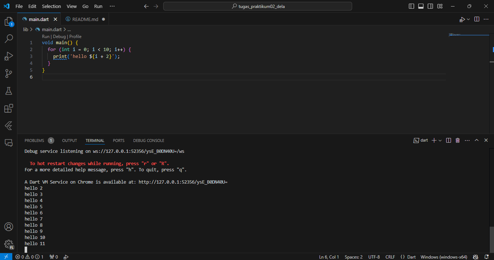
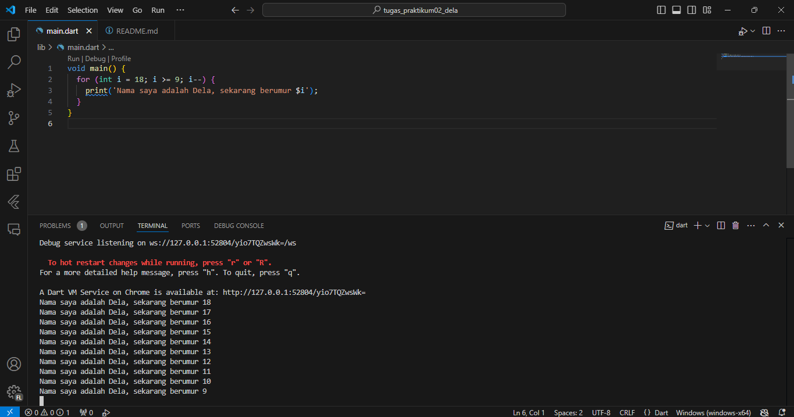

# Nama        : Dela Farahita Zain
# NIM         : 2241720058
# Kelas       : D-IV TI 3B
# Mata Kuliah : Pemrograman Mobile

1. Modifikasilah kode pada baris 3 di VS Code atau Editor Code favorit Anda berikut ini agar mendapatkan keluaran (output) sesuai yang diminta! \

2. Mengapa sangat penting untuk memahami bahasa pemrograman Dart sebelum kita menggunakan framework Flutter ? Jelaskan! \
Semua pengembangan menggunakan framework Flutter sangat bergantung pada pemahaman mendalam tentang bahasa Dart, karena kode aplikasi, plugin, dan manajemen dependensi semuanya menggunakan Dart dan fitur-fiturnya. Dengan memiliki pemahaman dasar yang kuat tentang Dart, kita akan lebih mudah menjadi produktif saat bekerja dengan Flutter dan merasa lebih nyaman dalam proses pengembangannya.

3. Rangkumlah materi dari codelab ini menjadi poin-poin penting yang dapat Anda gunakan untuk membantu proses pengembangan aplikasi mobile menggunakan framework Flutter. 
- Framework (Kerangka Kerja): kerangka program yang digunakan untuk membantu developer dalam mengembangkan kode secara konsisten.
- Flutter: framework open source yang dibuat oleh Google.
- Flutter memiliki tujuan: membangun sebuah framework untuk membuat UI yang modern, native dan reactive yang dapat berjalan di sistem operasi iOS maupun Android.
- Widget: konsep UI yang mirip dengan balok LEGO, di mana elemen-elemen sederhana dapat disusun dan dikombinasikan untuk membentuk antarmuka yang lebih kompleks.
- StatelessWidget: digunakan ketika value (state / konfigurasi) dari widget tersebut tidak pernah berubah.
- StatefullWidget: digunakan ketika value (state / konfigurasi) dari widget dapat berubah.
- Fitur: Productive tooling, Garbage collection, Type annotations (opsional), Statically typed, Portability.
- Productive tooling: fitur kakas (tool) untuk menganalisis kode, plugin IDE, dan ekosistem paket yang besar.
- Garbage collection: mengelola atau menangani dealokasi memori (terutama memori yang ditempati oleh objek yang tidak lagi digunakan).
- Type annotations (opsional): keamanan dan konsistensi dalam mengontrol semua data dalam aplikasi.
- Statically typed: meskipun anotasi tipe opsional, Dart tetap aman dengan menggunakan type-safe dan type inference untuk menganalisis tipe saat runtime, membantu menemukan bug selama kompilasi kode.
- Portability: bahasa Dart dapat digunakan tidak hanya untuk web (dengan terjemahan ke JavaScript) tetapi juga dikompilasi secara native ke kode ARM dan x86.
- Dart source: Dart VM dan dart2js.
- Dart VM: dapat dieksekusi pada lingkungan yang mendukung bahasa Dart untuk mengeksekusi kode dart.
- Dart2js -> javascript source: Just-In-Time (JIT) dan Ahead-Of-Time (AOT).
- Just-In-Time (JIT): digunakan untuk menjalankan kode pada command line atau selama proses pengembangan aplikasi mobile yang dapat memanfaatkan fitur seperti debugging dan hot reload.
- Ahead-Of-Time (AOT): Pendekatan ini memiliki keuntungan performa yang sangat besar dibandingkan kompilasi JIT, tetapi fitur lain seperti debugging dan hot reload tidak tersedia.
- Structure of the Dart language: Object orientation, Dart operators, Arithmetic operators, Increment and decrement operators, Equality and relational operators, Logical operators.  
- Object orientation: paradigma pemrograman yang menggunakan objek untuk menyimpan data (fields) dan kode (methods). Objek-objek ini dibuat dari class, yang mendefinisikan fields dan methods yang dimiliki objek tersebut.
- Dart operators: metode yang didefinisikan dalam class dengan sintaks khusus. Misalnya, operator == sama dengan memanggil metode x.==(y). Semua tipe data di Dart adalah turunan dari kelas, memungkinkan operator untuk diganti sesuai kebutuhan logika. 
- Arithmetic operators: + (tambah), -(pengurangan), *(perkalian), / (pembagian), ~/ (pembagian bilangan bulat), % (modulus : sisa bagi dari bilangan bulat), -expression (negasi : membalikkan suatu nilai). 
- Increment and decrement operators: ++var atau var++ untuk menambah nilai variabel var sebesar 1. --var atau var-- untuk mengurangi nilai variabel var sebesar 1.
- Equality and relational operators: Persamaan operator Dart dan pengujian relasional
- Persamaan operator Dart: == untuk memeriksa apakah operan sama. != untuk memeriksa apakah operan berbeda.
- Pengujian relasional: > memeriksa apakah operan kiri lebih besar dari operan kanan, < memeriksa apakah operan kiri lebih kecil dari operan kanan, >= memeriksa apakah operan kiri lebih besar dari atau sama dengan operan kanan, <= memeriksa apakah operan kiri kurang dari atau sama dengan operan kanan.
- Logical operators: !expression negasi atau kebalikan hasil ekspresi—yaitu, true menjadi false dan false menjadi true. || menerapkan operasi logika OR antara dua ekspresi. && menerapkan operasi logika AND antara dua ekspresi.
- Main function: 
- Tipe Data: void menunjukkan fungsi tidak mengembalikan nilai.
- Nama Fungsi: main adalah nama fungsi yang dicari Dart VM untuk memulai eksekusi.
- Parameter: Tanda kurung kosong berarti fungsi ini tidak menerima parameter.
- Kurung Kurawal: Menandai awal dan akhir kode fungsi main.
- Function versus method: Function berdiri sendiri di luar class, seperti fungsi main. Sedangkan Method terikat pada class dan memiliki referensi implisit ke instance class menggunakan keyword this.

4. Buatlah slide yang berisi penjelasan dan contoh eksekusi kode tentang perbedaan Null Safety dan Late variabel ! (Khusus soal ini kelompok berupa link google slide) 
Lampiran link ppt: https://docs.google.com/presentation/d/1TWT8u15t8a8fDfunn-J5za45DmKolcUXmRFgdP_d_gg/edit?usp=sharing